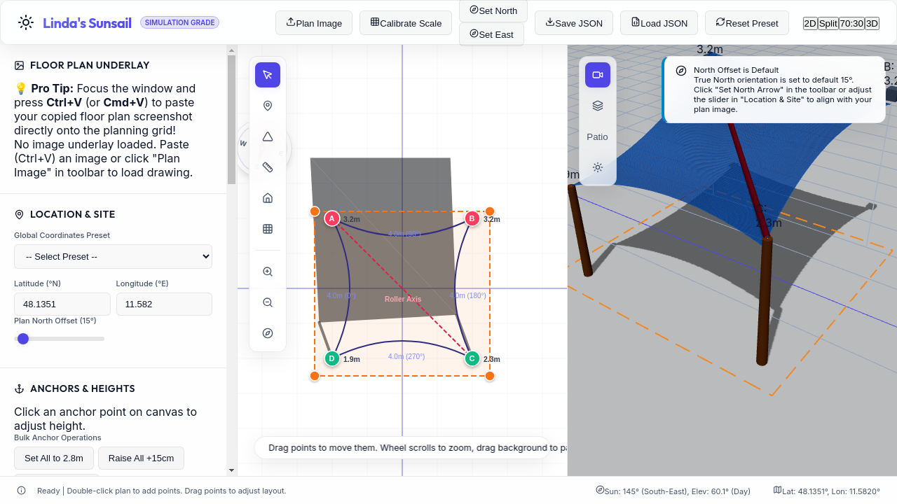
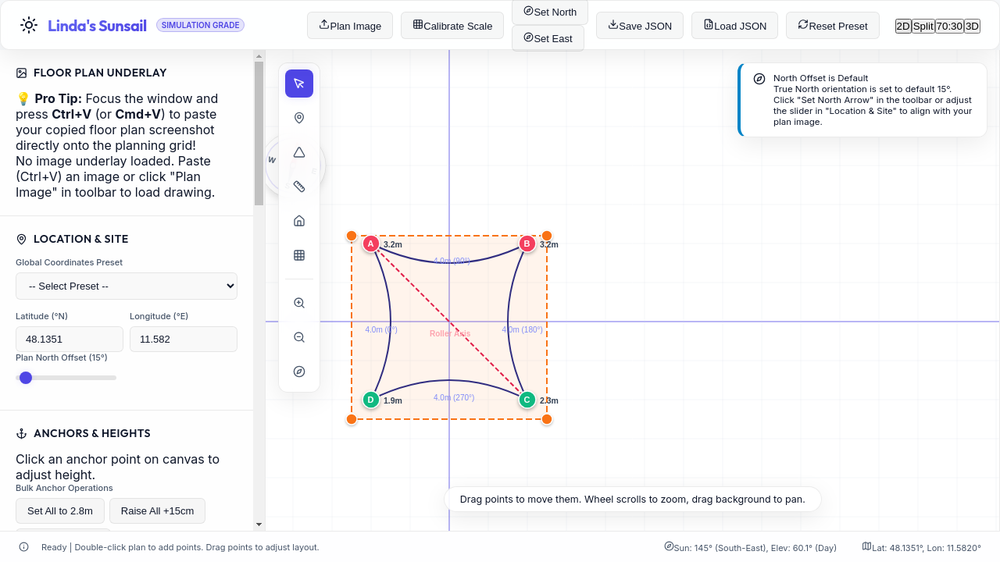
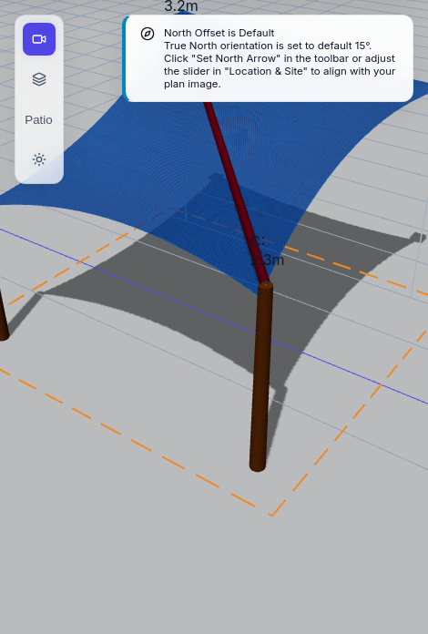
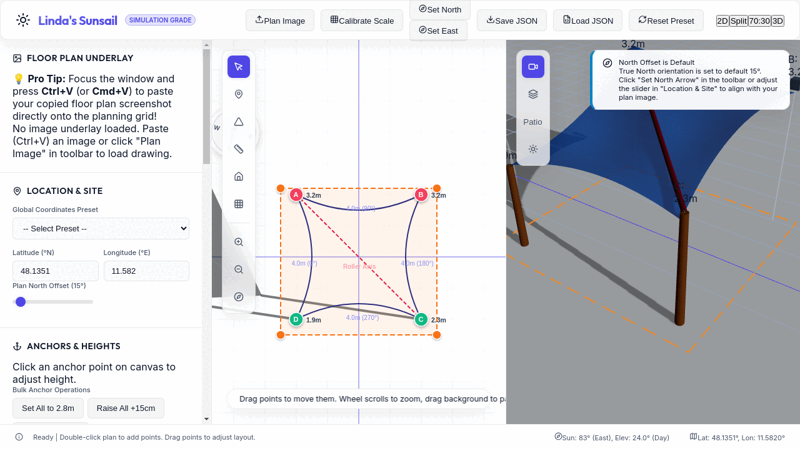
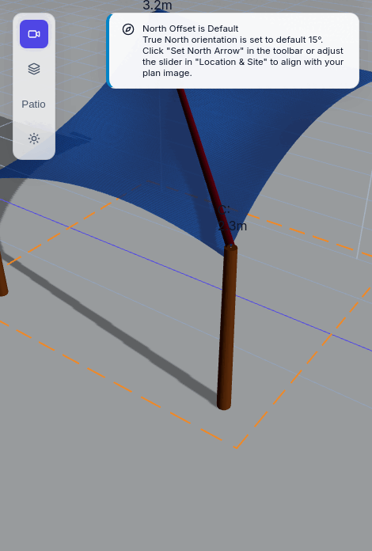

# ☀️ Linda's Sunsail

A premium, desktop-first, highly aesthetic local Shade Sail Planning Tool and high-precision Astronomical Simulation Engine. Built in **React + TypeScript + Three.js (R3F)**, **Linda's Sunsail** enables residential planners and homeowners to upload blueprint floor plans, draft custom shade sail structures, optimize post heights, and run real-time solar shadow animations for any site coordinates, date, and hour.

🌐 **[Try the Live Interactive Simulator on GitHub Pages!](https://jrosskopf.github.io/lindas-sunsail/)**

---

## 📸 Interactive Workspace Screenshots

Here is a visual tour of **Linda's Sunsail** in action, captured directly from our local simulation grades:

### 1. Unified 50/50 Dual Planning Workspace
A synchronized side-by-side design environment pairing our custom CAD 2D plan editor with the real-time Three.js WebGL physical viewport.


### 2. Isolated 2D Floor Plan CAD Board
Featuring high-precision scale calibration, interactive drag-handles for sails, house obstacles, and the terrace boundaries, plus our real-time oblique parallel projected shadows and the draggable geographical HUD compass rose.


### 3. Isolated 3D Astronomical Scene
Interactive Three.js environment showing saddle mesh curvature, guide posts with floating height meters, a glowing sun sphere sweep, and accurate high-contrast structural ground shadows.


### 🎬 Real-time Solar Shadow Animations
Watch **Linda's Sunsail** Astronomical Sun & Shadow Engine dynamically scrub through hours from **08:00 AM to 06:00 PM** (standard Munich coordinates), showing exact real-time shadow movements:

#### A. Unified Dual Workspace Time Lapse


#### B. Focused 3D Shadow Sweep


---

## ✨ Outstanding Core Features

### 📐 2D Floor Plan Editor (Konva CAD)
* **Calibration Scales:** Calibrate any blueprint or site image by drawing a segment between two points and entering real-world dimensions in centimeters.
* **Dual-Axis Orientation Calibration:** Calibrate plan orientation by drawing a vector representing either **True North** (South base $\to$ North tip) or **True East** (West base $\to$ East tip). East arrow calibrations automatically rotate North by $90^\circ$ counter-clockwise using `(angle - 90 + 360) % 360`.
* **Draggable Compass Rose HUD:** A beautiful glassmorphic circular HUD compass rose that can be dragged anywhere on the canvas. The dial face rotates dynamically by `+northOffsetDeg`, aligning the **"N"** needle tip with True geographical North, and adjusting the **"E"**, **"S"**, and **"W"** markers relative to the plan boundaries.
* **CAD Rulers & Dimensions:** Rulers show real-world distances in meters and clockwise compass bearing angles for all shade sail margins.

### ⛺ 3D Hinge Mesh & Saddle Curvature (React Three Fiber)
* **Dual-Triangle Hinge Model:** If a sail is a quad (e.g. A-B-C-D) and has a diagonal roller axis (e.g., A-C), the mesh generator automatically splits it into two distinct triangle meshes (A-B-C and A-D-C) meeting at the 3D roller tube, modeling realistic folding and runoff slope.
* **Stylized saddle (hypar) shapes:** Applies barycentric grid subdivisions with inward border pulling to simulate rope-tension and hyperbolic paraboloid saddle shape deformations.
* **Guide Pillars:** Renders copper wall-mount brackets or wood-grained guide posts with custom floating height labels.

### ☀️ Sun & Shadow Astronomical Engine
* **Sun Position Calculations:** Leverages `SunCalc` to determine site-specific sun azimuth and elevation based on the latitude, longitude, and date/time.
* **Oblique Parallel Projections:** Projects structural shadows of the sails, pillars, and house obstacles onto the plan coordinate plane ($z=0$) using parallel solar rays.
* **Terrace Shade Coverage KPI:** Projects structural shadows onto the ground and runs a 25x25 grid sampling area intersection over the custom terrace boundary to calculate the exact percentage (%) of shade coverage.
* **SVG Hourly Shade Chart:** Plots a daily shade profile chart from 8:00 AM to 6:00 PM to help planners optimize attachment heights.
* **Diagnostic Warnings:** Provides real-time notifications for slope runoff drainage caution (cautioning if any quad/triangle diagonal slope is $<25\%$ or $14^\circ$).

---

## 🛠️ Architecture & Technology Stack

- **Framework:** React 19 + TypeScript 6 + Vite 8 (desktop-first)
- **2D Canvas Layer:** `react-konva` & `konva` (supporting panning, zooming, and sub-pixel coordinate grabs)
- **3D Canvas Layer:** `@react-three/fiber` & `@react-three/drei` (Three.js WebGL with OrbitControls)
- **State Management:** `zustand` (with a 50-step Undo/Redo serialized state snapshot stack)
- **Astronomical Math:** `suncalc` & custom linear coordinate rotation matrices
- **Design System:** Custom glassmorphic vanilla CSS (macOS-inspired translucent floating elements, capsule buttons, custom sliders)

---

## 🧮 Oblique Solar Projection Mathematics

To map a 3D vertex $P = (x, y, z)$ along a normalized sun directional vector $\vec{s} = (s_x, s_y, s_z)$ onto the ground plane $(z=0)$, we calculate the intersection point $P_{shadow}$:

$$P_{shadow} = \left(x - z \frac{s_x}{s_z}, \ y - z \frac{s_y}{s_z}, \ 0\right)$$

This mathematical projection correctly scales shadow lengths relative to solar height and rotates them relative to the customized plan offset angle.

---

## 🚀 Getting Started

### 1. Installation
Clone the repository and install the dependencies:
```bash
npm install
```

### 2. Run the Local Development Server
Boot up the dev environment:
```bash
npm run dev
```

### 3. Production Build
Compile and bundle the production assets:
```bash
npm run build
```

---

## 📄 License

This project is licensed under the terms of the **BSD 3-Clause License**. See the [LICENSE](LICENSE) file for the full text.
